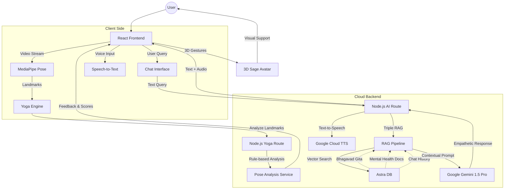

# GitaGyan 
---

##  The Vision
**GitaGyan** is an empathetic, AI-powered mental wellness solution designed specifically for the Indian youth. By bridging the gap between **ancient Vedic wisdom (Bhagavad Gita)** and **modern psychological practices**, GitaGyan provides a confidential, non-judgmental, and culturally sensitive outlet for students and young adults facing academic pressure, social anxiety, and existential confusion.

## The Challenge: Mental Health Stigma in India
In India, mental health remains a significant societal taboo. High costs, limited availability of professionals, and pervasive social stigma prevent millions of young adults from seeking help. Amidst intense academic and social pressures, they often lack a safe space to express their concerns without fear of judgment.

## Our Solution
Leveraging **Google Cloud’s Generative AI**, GitaGyan offers a holistic wellness ecosystem:
- **Triple RAG Architecture:** A unique AI engine that retrieves context from the Bhagavad Gita, curated mental health resources, and the user's own semantic history.
- **3D Interactive Sage:** An immersive, empathetic AI companion (Sage-Avatar) providing real-time emotional support through speech and visuals.
- **AI Yoga & Meditation:** Real-time pose correction using MediaPipe and guided mindfulness sessions to reduce stress.
- **Confidential & Empathetic:** A safe, anonymous space to discuss concerns, destigmatizing mental health discussions through a familiar spiritual lens.

---

## Key Features

### Triple-RAG AI Engine
Unlike standard chatbots, GitaGyan uses a **Triple-Retrieval-Augmented Generation** pipeline:
1.  **Scriptural Context:** Extracts relevant verses from the Bhagavad Gita to provide timeless wisdom.
2.  **Clinical Context:** Integrates modern mental health resources for evidence-based guidance.
3.  **User Context:** Remembers past conversations semantically to build a long-term empathetic relationship.

### AI-Powered Yoga Coach
Real-time yoga pose detection and correction powered by **MediaPipe**. 
- 8+ essential yoga poses (Tadasana, Vrikshasana, etc.)
- Real-time feedback on posture accuracy.
- Progress tracking and wellness sessions.

### Interactive 3D Sage Avatar
A visually rich, Three.js-based 3D avatar that acts as a digital companion.
- **Emotionally Aware:** The avatar responds with appropriate gestures based on the user's sentiment.
- **Voice Interactive:** Integrated with Google Cloud Text-to-Speech and Speech-to-Text for natural conversations.

### Holistic Wellness Check-ins
- **Adaptive Surveys:** Daily mood tracking and mental health screenings.
- **Personalized Insights:** Longitudinal data analysis to provide wellness trends and suggestions.
- **Language Support:** Accessible in multiple Indian languages to break cultural barriers.

---

## Tech Stack

### Frontend
- **Framework:** React 19 (TypeScript) + Vite
- **Styling:** Tailwind CSS + Framer Motion + MagicUI (Shadcn/UI based)
- **3D Rendering:** Three.js (@react-three/fiber, @react-three/drei)
- **Computer Vision:** MediaPipe (Pose Detection)


### Backend
- **Runtime:** Node.js (Express)
- **Databases:** 
    - **Astra DB (DataStax):** Vector Search for RAG pipeline.
    - **MongoDB (Mongoose):** User profiles and longitudinal data.
- **AI/ML Integration:**
    - **Google Generative AI (Gemini):** Core reasoning and response generation.
    - **Hugging Face:** Emotion detection and safety classification.
    - **LangChain:** Document splitting and RAG orchestration.
- **Audio:** Google Cloud TTS.

---

## Architecture Overview



---

## Getting Started

### Prerequisites
- Node.js (v18+)
- MongoDB & Astra DB Accounts
- Google Cloud API Key (Gemini & TTS)

### Installation

1. **Clone the Repository**
   ```bash
   git clone https://github.com/Chandrashekher1/GitaGyan.git
   cd GitaGyan
   ```

2. **Backend Setup**
   ```bash
   cd Backend
   npm install
   # Create a .env file with your API keys
   npm run dev
   ```

3. **Frontend Setup**
   ```bash
   cd ../Frontend
   npm install
   npm run dev
   ```

---

## Safety & Ethics
GitaGyan is designed with safety as a priority:
- **Safety Classifier:** Every user message is screened for crisis indicators (self-harm, etc.).
- **Escalation Path:** If a crisis is detected, the AI provides emergency helpline numbers immediately.
- **Confidentiality:** No PII (Personally Identifiable Information) is used in the RAG vectorization process.
- **Disclaimer:** GitaGyan is an AI-powered wellness tool and **not a substitute for professional clinical therapy**.

---


**✨ Bridging tradition with technology for a healthier, more mindful youth. ✨**

### Developed By : 

Chandrashekher Prasad & Tanshiq Sethi
